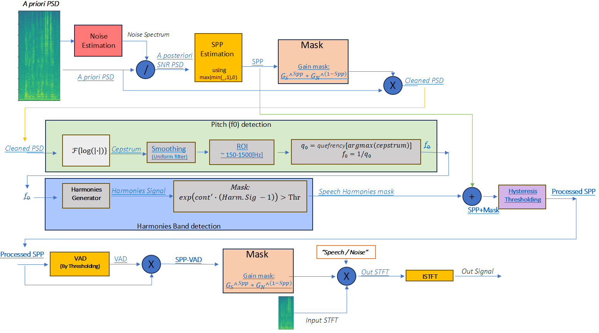

# Speech Enhancement / Removal Tool
Analytic speech enhancement or removal algorithm


## 1. Goal
This project implements an analytic speech enhancement and removal algorithm.
It can:
1. Enhance speech in noisy audio recordings.
2. Remove speech and isolate background noise.

The tool is based on traditional digital signal processing (DSP) techniques and is suitable for scenarios where explainability and fine control over the algorithm are important.


## 2. Overview of the Solution
The algorithm operates in the time–frequency domain using the following main steps:
1. Noise Estimation – Estimates the noise spectrum profile.
2. Speech Presence Probability (SPP) Estimation – Calculates the probability that speech is present in each time–frequency bin.
3. Pitch Tracking (f₀ detection) – Uses cepstrum analysis to detect the fundamental frequency of speech.
4. Harmonies-based Masking – Detects harmonic structures of speech and creates a mask.
5. Hysteresis Thresholding – Refines the mask by keeping only connected speech regions.
6. Voice Activity Detection (VAD) – Removes processing from non-speech frames.
7. Gain Mask Application – Applies the mask to either keep speech or keep noise.
8. Inverse STFT – Reconstructs the time-domain signal.

This design allows both:
1. Speech enhancement (keep speech, suppress noise).
2. Speech removal (keep noise, suppress speech).


## 3. 📂 Repository Structure
```bash
SpeechEnhancementRemovalTool/
├── docs/
│   ├── Overview.png
│   └── speech_enhancement_presentation.pdf
├── examples/
│   ├── example_input.wav
│   ├── example_output_speech.wav
│   └── example_output_noise.wav
├── src/
│   └── SpeechRemovalTool.py
├── requirements.txt
└── README.md
```
* **`docs/system_overview.png`**: System overview diagram extracted from the presentation, used in the README.
* **`docs/speech_enhancement_presentation.pdf`**: Presentation slides explaining the algorithm in detail.
* **`Examples/`**: Example input and processed audio files for quick testing.
* **`src/SpeechRemovalTool.py`**: Main Python implementation of the speech enhancement / removal algorithm.
* **`requirements.txt`**: List of Python dependencies needed to run the code.
* **`README.md`**: Project description and usage instructions (this file).

## 4. System Overview

Component Descriptions
1. Input & STFT: The input audio is transformed into the time–frequency domain using Short-Time Fourier Transform (STFT).

2. Noise Estimation: For each frequency bin, the algorithm builds a histogram of power values over time.
The mode (most common value) is selected as the noise floor.

3. A Posteriori & A Priori PSD: 
A posteriori PSD: ratio of noisy signal power to estimated noise power.
A priori PSD: a smoothed version of the a posteriori PSD, providing more stable estimates.
These PSDs are used to evaluate the speech presence probability (SPP).

4. SPP Estimation: The Speech Presence Probability (SPP) indicates how likely it is that speech exists in each time–frequency bin.
Computed from smoothed SNR values, scaled between 0 and 1. Forms the basis for distinguishing speech from noise.

5. Pitch Tracking (f₀ Detection): The cepstrum peak gives the fundamental frequency (f₀). The f₀ is smoothed over time to ensure robust pitch tracking.

6. Harmonics-Based Masking: Generates harmonic patterns aligned with f₀. Low-frequency bins below f₀/4 are suppressed to avoid false detections.

7. Hysteresis Thresholding: Refines the SPP + Harmonics mask by enforcing continuity. Weak detections are kept only if connected to strong ones.
Reduces isolated false alarms and yields cleaner speech regions.

8. Voice Activity Detection (VAD): Frames with low speech probability are excluded from further processing. Prevents artifacts in non-speech regions.

9. Gain Mask Application  
   Combines all previous masks into a gain function:
   - **Enhancement Mode:** keep speech, suppress noise.  
   - **Removal Mode:** suppress speech, keep noise.  
   Gain values are applied in the STFT domain.
10. ISTFT & Output: The masked STFT is converted back to the time domain using ISTFT.

Final result: either cleaned speech or isolated noise.


## 5. Examples
### Example 1
- [Example 1 – Noisy](examples/Example_1_Noisy.wav)  
  A short audio recording containing speech mixed with background noise.  

- [Example 1 – keep speech](examples/Example_1_keep_speech_soft_vad.wav)  
  The same recording after processing, where the speech is enhanced and most of the noise is suppressed.  

- [Example 1 – keep noise](examples/Example_1_keep_noise.wav)  
  The extracted background noise from the original recording, with the speech largely removed.  
